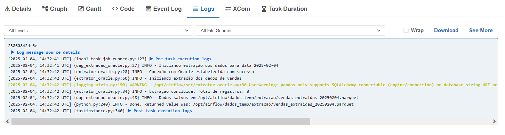

# Pipeline com ETL usando Airflow, Oracle, Postgres e Docker

O projeto utiliza Docker para conteinerização do processo de ETL com Airflow, Oracle e Postgres.


## 1. Processo de ETL no Airflow

Este projeto exemplifica um processo de ETL (Extração, Transformação e Carga) utilizando o Apache Airflow em um ambiente Docker. O fluxo de dados envolve a extração de dados de um banco de dados Oracle, a transformação desses dados e, finalmente, a carga no PostgreSQL.

### 1.1 Dags no Airflow


---

### 1.1.1 Fluxo ETL - Estratégia por Triggers


## 2. Extração

A extração dos dados é realizada por meio de uma DAG (Directed Acyclic Graph) no Airflow, utilizando o arquivo `dag_extracao_oracle.py`. O processo de extração é feito pela classe `ExtratorOracle`, que se conecta ao banco de dados Oracle e executa uma consulta SQL para obter os dados de vendas.


### 2.1 Código da Extração

DAG

```python
from airflow import DAG
from airflow.operators.python import PythonOperator
from airflow.operators.trigger_dagrun import TriggerDagRunOperator
from datetime import datetime, timedelta
import logging
from src.extrator_oracle import ExtratorOracle
from src.config import Configuracao
import pandas as pd

logging.basicConfig(
    level=Configuracao.NIVEL_LOG,
    format='%(asctime)s - %(name)s - %(levelname)s - %(message)s'
)
logger = logging.getLogger(__name__)

args_padrao = {
    'owner': 'airflow',
    'depends_on_past': False,
    'email_on_failure': True,
    'email_on_retry': False,
    'retries': 1,
    'retry_delay': timedelta(seconds=20),
}

def extrair_dados(data_execucao: str, **context):    
    """Extrai dados do Oracle e salva em arquivo Parquet"""
    logger.info(f"Iniciando extração dos dados para data {data_execucao}")
    
    try:
        data_execucao = datetime.strptime(data_execucao, "%Y-%m-%d")
    except ValueError:
        raise ValueError(f"Formato inválido para data_execucao: {data_execucao}. Esperado 'YYYY-MM-DD'.")
    
    Configuracao.criar_diretorios()
    
    extrator = ExtratorOracle(Configuracao.CONFIG_ORACLE)
    
    try:
        df = extrator.extrair_dados_vendas(Configuracao.TAMANHO_LOTE)
        
        caminho_arquivo = Configuracao.obter_caminho_arquivo(
            Configuracao.DIR_EXTRACAO,
            'vendas_extraidas',
            data_execucao
        )
        
        df.to_parquet(caminho_arquivo, index=False)
        logger.info(f"Dados salvos em {caminho_arquivo}")
        
        return caminho_arquivo
        
    except Exception as e:
        logger.error(f"Erro durante a extração: {str(e)}")
        raise

dag = DAG(
    'vendas_extracao',
    default_args=args_padrao,
    description='Pipeline de extração de dados de vendas',
    schedule_interval=None,
    start_date=datetime(2024, 1, 1),
    catchup=False,
    tags=['vendas', 'extracao'],
    max_active_runs=1,
)

tarefa_extracao = PythonOperator(
    task_id='extrair_dados_vendas',
    python_callable=extrair_dados,
    op_kwargs={'data_execucao': '{{ ds }}'},
    provide_context=True,
    dag=dag,
)

trigger_transformacao = TriggerDagRunOperator(
    task_id='trigger_transformacao',
    trigger_dag_id='vendas_transformacao',
    poke_interval=30,  # Tempo entre verificações do estado da DAG filha
    conf={"data_execucao": "{{ ds }}"},
    dag=dag,
)

tarefa_extracao >> trigger_transformacao

```
Classe de extração

```python
import logging
import cx_Oracle
import pandas as pd
from typing import Optional
from pathlib import Path
from src.config import ConfiguracaoBanco

logger = logging.getLogger(__name__)

class ExtratorOracle:
    def __init__(self, config: ConfiguracaoBanco):
        self.config = config
        self.conexao = None

    def conectar(self) -> None:
        """Estabelece conexão com o banco Oracle"""
        try:
            dsn = cx_Oracle.makedsn(
                self.config.host,
                self.config.porta,
                service_name=self.config.banco
            )
            self.conexao = cx_Oracle.connect(
                user=self.config.usuario,
                password=self.config.senha,
                dsn=dsn
            )
            logger.info("Conexão com Oracle estabelecida com sucesso")
        except Exception as erro:
            logger.error(f"Erro ao conectar com Oracle: {str(erro)}")
            raise

    def _executar_consulta(self, consulta: str, tamanho_lote: int) -> pd.DataFrame:
        """Executa consulta SQL e retorna DataFrame"""
        try:
            df = pd.read_sql(
                consulta,
                self.conexao,
                chunksize=tamanho_lote
            )
            return df
        except Exception as erro:
            logger.error(f"Erro ao executar consulta: {str(erro)}")
            raise

    def extrair_dados_vendas(self, tamanho_lote: int) -> pd.DataFrame:
        """
        Extrai dados da tabela SALES_TRANSACTIONS
        
        Args:
            tamanho_lote: Quantidade de registros por lote
            
        Returns:
            DataFrame com os dados extraídos
        """
        if not self.conexao:
            self.conectar()

        try:
            logger.info("Iniciando extração dos dados de vendas")
            
            consulta = """
                SELECT 
                    TRANSACTION_ID,
                    CUSTOMER_ID,
                    AMOUNT,
                    TRANSACTION_DATE
                FROM "SYSTEM"."SALES_TRANSACTIONS" 
                WHERE TRUNC(TRANSACTION_DATE) = TRUNC(SYSDATE - 1)
            """

            dataframes = []
            for chunk in self._executar_consulta(consulta, tamanho_lote):
                dataframes.append(chunk)
                logger.debug(f"Lote de {len(chunk)} registros processado")

            df_final = pd.concat(dataframes, ignore_index=True)
            
            # Validações básicas
            if df_final.empty:
                logger.warning("Nenhum dado encontrado para extração")
                return pd.DataFrame()
                
            logger.info(f"Extração concluída. Total de registros: {len(df_final)}")
            return df_final
            
        except Exception as erro:
            logger.error(f"Erro durante extração dos dados: {str(erro)}")
            raise
        finally:
            if self.conexao:
                self.conexao.close()
                logger.debug("Conexão com Oracle fechada")

    def salvar_dados(self, df: pd.DataFrame, caminho_arquivo: str) -> None:
        """
        Salva DataFrame em arquivo Parquet
        
        Args:
            df: DataFrame com os dados
            caminho_arquivo: Caminho completo do arquivo de saída
        """
        try:
            # Cria diretório se não existir
            Path(caminho_arquivo).parent.mkdir(parents=True, exist_ok=True)
            
            # Salva arquivo
            df.to_parquet(
                caminho_arquivo,
                index=False,
                compression='snappy'  # Bom equilíbrio entre compressão e velocidade
            )
            
            logger.info(f"Dados salvos com sucesso em: {caminho_arquivo}")
            
        except Exception as erro:
            logger.error(f"Erro ao salvar arquivo: {str(erro)}")
            raise

```

### 2.2 Funcionamento

- **Conexão com Oracle**: A classe `ExtratorOracle` estabelece a conexão com o banco de dados Oracle utilizando a biblioteca `cx_Oracle`.
- **Consulta SQL**: A consulta é realizada na tabela `SALES_TRANSACTIONS` para obter dados de vendas do dia anterior.
- **Armazenamento**: Os dados extraídos são salvos em um arquivo Parquet para uso posterior na transformação.

### 2.3 Registros no banco de dados Oracle


### 2.4 Registros extraídos do banco de dados Oracle


### 2.5 Log da execução da extração do Oracle no Airflow


---

## 3. Transformação

Após a extração, os dados precisam ser transformados. Essa etapa é gerenciada pela DAG `dag-transformacao.py`, onde a classe `TransformadorDadosVendas` aplica as transformações necessárias nos dados extraídos.

### 3.1 Código da Transformação

DAG

```python
from airflow import DAG
from airflow.operators.python import PythonOperator
from airflow.operators.trigger_dagrun import TriggerDagRunOperator
from datetime import datetime, timedelta
import logging
from src.transformacao import TransformadorDadosVendas
from src.config import Configuracao
import pandas as pd

logging.basicConfig(
    level=Configuracao.NIVEL_LOG,
    format='%(asctime)s - %(name)s - %(levelname)s - %(message)s'
)
logger = logging.getLogger(__name__)

args_padrao = {
    'owner': 'airflow',
    'depends_on_past': False,
    'email_on_failure': True,
    'email_on_retry': False,
    'retries': 3,
    'retry_delay': timedelta(minutes=5),
}

def transformar_dados(**context):
    """Transforma os dados extraídos e salva em novo arquivo Parquet"""
    data_execucao = context['dag_run'].conf.get('data_execucao', context['ds'])
    logger.info(f"Iniciando transformação dos dados para data {data_execucao}")
    
    try:
        data_execucao = datetime.strptime(data_execucao, "%Y-%m-%d")
    except ValueError:
        raise ValueError(f"Formato inválido para data_execucao: {data_execucao}. Esperado 'YYYY-MM-DD'.")
        
    try:
        arquivo_entrada = Configuracao.obter_caminho_arquivo(
            Configuracao.DIR_EXTRACAO,
            'vendas_extraidas',
            data_execucao
        )

        df = pd.read_parquet(arquivo_entrada)
        if df.empty:
            raise ValueError(f"O arquivo {arquivo_entrada} está vazio ou corrompido.")

        logger.info(f"Arquivo de entrada carregado com sucesso: {arquivo_entrada}")
        
        transformador = TransformadorDadosVendas()
        df_transformado = transformador.transformar_dados(df)
        
        arquivo_saida = Configuracao.obter_caminho_arquivo(
            Configuracao.DIR_TRANSFORMACAO,
            'vendas_transformadas',
            data_execucao
        )
        
        df_transformado.to_parquet(arquivo_saida, index=False)
        logger.info(f"Dados transformados salvos em {arquivo_saida}")
        
        return arquivo_saida
        
    except Exception as e:
        logger.error(f"Erro durante a transformação: {str(e)}")
        raise

dag = DAG(
    'vendas_transformacao',
    default_args=args_padrao,
    description='Pipeline de transformação de dados de vendas',
    schedule_interval=None,
    start_date=datetime(2024, 1, 1),
    catchup=False,
    tags=['vendas', 'transformacao'],
    max_active_runs=1,
)

tarefa_transformacao = PythonOperator(
    task_id='transformar_dados_vendas',
    python_callable=transformar_dados,
    provide_context=True,
    dag=dag,
)

# Adicionando o TriggerDagRunOperator para acionar a DAG de carga
trigger_carga = TriggerDagRunOperator(
    task_id='trigger_carga_postgres',
    trigger_dag_id='vendas_carga_postgres',  # Nome da DAG de carga
    poke_interval=30,  # Tempo entre verificações do estado da DAG filha
	conf={"data_execucao": "{{ ds }}"},  # Passa a data de execução para a DAG de carga
    dag=dag,
)

# Definindo a ordem das tarefas
tarefa_transformacao >> trigger_carga
```
Classe de transformação

```python
import pandas as pd
import numpy as np
import logging
from typing import Optional, Dict
from pathlib import Path

logger = logging.getLogger(__name__)

class TransformadorDadosVendas:
    def __init__(self):
        self.metricas = {
            'registros_iniciais': 0,
            'registros_invalidos': 0,
            'registros_processados': 0
        }

    def _categorizar_valor(self, amount: float) -> str:
        """
        Categoriza o valor da transação
        
        Args:
            amount: Valor da transação
            
        Returns:
            category (LOW, MEDIUM, HIGH)
        """
        if amount < 100:
            return 'LOW'
        elif amount <= 500:
            return 'MEDIUM'
        else:
            return 'HIGH'

    def _validar_dados(self, df: pd.DataFrame) -> pd.DataFrame:
        """
        Valida e limpa os dados antes da transformação
        
        Args:
            df: DataFrame com os dados
            
        Returns:
            DataFrame com dados válidos
        """
        # Normaliza os nomes das colunas para evitar erro
        df.columns = df.columns.str.lower()

        # Remove registros com valores nulos
        df_valido = df.dropna(subset=['transaction_id', 'customer_id', 'amount'])
        
        # Remove duplicatas
        df_valido = df_valido.drop_duplicates(subset=['transaction_id'])
        
        # Registra métricas
        self.metricas['registros_invalidos'] = len(df) - len(df_valido)
        
        return df_valido

    def transformar_dados(self, df: pd.DataFrame) -> pd.DataFrame:
        """
        Aplica transformações nos dados de vendas
        
        Args:
            df: DataFrame com os dados brutos
            
        Returns:
            DataFrame com dados transformados
        """
        try:
            logger.info("Iniciando transformação dos dados")
            
            self.metricas['registros_iniciais'] = len(df)
            
            # Validação inicial
            df_valido = self._validar_dados(df)
                                    
            if df_valido.empty:
                logger.warning("Nenhum dado válido para transformação")
                return pd.DataFrame()
            
            # Aplica transformações
            df_transformado = df_valido.copy()
            
            # Remove registros com valor <= 0
            df_transformado = df_transformado[df_transformado['amount'] > 0]
            
            # Normaliza ID do cliente
            df_transformado['customer_id'] = df_transformado['customer_id'].str.upper()
            
            # Adiciona categoria
            df_transformado['category'] = df_transformado['amount'].apply(self._categorizar_valor)
            
            # Adiciona data de processamento para metadados posteriormente
            #df_transformado['data_processamento'] = pd.Timestamp.now()
            
            # Atualiza métricas
            self.metricas['registros_processados'] = len(df_transformado)
            
            self._registrar_metricas()
            
            logger.info("Transformação concluída com sucesso")
            return df_transformado
            
        except Exception as erro:
            logger.error(f"Erro durante transformação dos dados: {str(erro)}")
            raise

    def _registrar_metricas(self) -> None:
        """Registra métricas de processamento"""
        logger.info("Métricas de transformação:")
        logger.info(f"- Registros iniciais: {self.metricas['registros_iniciais']}")
        logger.info(f"- Registros inválidos: {self.metricas['registros_invalidos']}")
        logger.info(f"- Registros processados: {self.metricas['registros_processados']}")

    def carregar_arquivo(self, caminho_arquivo: str) -> pd.DataFrame:
        """
        Carrega dados do arquivo Parquet
        
        Args:
            caminho_arquivo: Caminho do arquivo de entrada
            
        Returns:
            DataFrame com os dados carregados
        """
        try:
            logger.info(f"Carregando dados do arquivo: {caminho_arquivo}")
            return pd.read_parquet(caminho_arquivo)
        except Exception as erro:
            logger.error(f"Erro ao carregar arquivo: {str(erro)}")
            raise

    def salvar_arquivo(self, df: pd.DataFrame, caminho_arquivo: str) -> None:
        """
        Salva dados transformados em arquivo Parquet
        
        Args:
            df: DataFrame com dados transformados
            caminho_arquivo: Caminho do arquivo de saída
        """
        try:
            # Cria diretório se não existir
            Path(caminho_arquivo).parent.mkdir(parents=True, exist_ok=True)
            
            # Salva arquivo
            df.to_parquet(
                caminho_arquivo,
                index=False,
                compression='snappy'
            )
            
            logger.info(f"Dados transformados salvos em: {caminho_arquivo}")
            
        except Exception as erro:
            logger.error(f"Erro ao salvar arquivo transformado: {str(erro)}")
            raise

```
### 3.2 Funcionamento

- **Validação**: A transformação inclui validações para remover registros inválidos e duplicados.
- **Categorização**: Os dados são categorizados com base no valor da transação (LOW, MEDIUM, HIGH).
- **Armazenamento**: Os dados transformados são salvos em um novo arquivo Parquet.


### 3.3 Registros tratados e enriquecidos prontos para carga


### 3.4 Log da execução da transformação dos dados no Airflow


---

## 4. Carga

A carga dos dados transformados para o banco de dados PostgreSQL é feita pela DAG `dag-carga_postgres.py`. A classe `CargaPostgres` estabelece a conexão com o banco e carrega os dados.

### 4.1 Código da Carga

DAG

```python
from airflow import DAG
from airflow.operators.python import PythonOperator
from airflow.operators.trigger_dagrun import TriggerDagRunOperator
from datetime import datetime, timedelta
import logging
from src.carga_postgres import CargaPostgres
from src.config import Configuracao
import pandas as pd

logging.basicConfig(
    level=Configuracao.NIVEL_LOG,
    format='%(asctime)s - %(name)s - %(levelname)s - %(message)s'
)
logger = logging.getLogger(__name__)

args_padrao = {
    'owner': 'airflow',
    'depends_on_past': False,
    'email_on_failure': True,
    'email_on_retry': False,
    'retries': 3,
    'retry_delay': timedelta(minutes=5),
}

def carregar_dados(**context):
    """Carrega os dados transformados para o PostgreSQL"""
    data_execucao = context['dag_run'].conf.get('data_execucao', context['ds'])
    logger.info(f"Iniciando carregamento dos dados para data {data_execucao}")
    
    try:
        data_execucao = datetime.strptime(data_execucao, "%Y-%m-%d")
    except ValueError:
        raise ValueError(f"Formato inválido para data_execucao: {data_execucao}. Esperado 'YYYY-MM-DD'.")
        
    try:
        # Obtém o caminho do arquivo transformado
        arquivo_entrada = Configuracao.obter_caminho_arquivo(
            Configuracao.DIR_TRANSFORMACAO,
            'vendas_transformadas',
            data_execucao
        )

        # Instancia a classe de carga e carrega os dados
        carga = CargaPostgres(Configuracao.CONFIG_POSTGRES)
        carga.carregar_dados(arquivo_entrada)
        
        logger.info(f"Dados carregados com sucesso para o PostgreSQL a partir de {arquivo_entrada}")
        
    except Exception as e:
        logger.error(f"Erro durante o carregamento: {str(e)}")
        raise

dag = DAG(
    'vendas_carga_postgres',
    default_args=args_padrao,
    description='Pipeline de carga de dados de vendas para o PostgreSQL',
    schedule_interval=None,
    start_date=datetime(2024, 1, 1),
    catchup=False,
    tags=['vendas', 'carga', 'postgres'],
    max_active_runs=1,
)

tarefa_carga = PythonOperator(
    task_id='carregar_dados_postgres',
    python_callable=carregar_dados,
    provide_context=True,
    dag=dag,
)

```
Classe de carga

```python
import logging
import psycopg2
import pandas as pd
from sqlalchemy import create_engine
from typing import Optional
from pathlib import Path
from src.config import ConfiguracaoBanco, Configuracao

logger = logging.getLogger(__name__)

class CargaPostgres:
    def __init__(self, config: ConfiguracaoBanco):
        self.config = config
        self.conexao = None
        self.engine = None
        self.metricas = {
            'registros_inseridos': 0
        }

    def conectar(self) -> None:
        #Estabelece conexão com o banco PostgreSQL usando psycopg2 e SQLAlchemy
        try:
            # Conexão usando psycopg2 (para operações manuais)
            self.conexao = psycopg2.connect(
                host=self.config.host,
                port=self.config.porta,
                database=self.config.banco,
                user=self.config.usuario,
                password=self.config.senha
            )
            logger.info("Conexão com PostgreSQL (psycopg2) estabelecida com sucesso")

            # Conexão usando SQLAlchemy (para to_sql com lotes)
            self.engine = create_engine(
                f"postgresql+psycopg2://{self.config.usuario}:{self.config.senha}@{self.config.host}:{self.config.porta}/{self.config.banco}"
            )
            logger.info("Conexão com PostgreSQL (SQLAlchemy) estabelecida com sucesso")
        except Exception as erro:
            logger.error(f"Erro ao conectar com PostgreSQL: {str(erro)}")
            raise

    def criar_esquema_tabela(self) -> None:
        """
        Cria o esquema 'analytics' e a tabela 'analytics_transactions' se não existirem.
        """
        if not self.conexao:
            self.conectar()

        try:
            with self.conexao.cursor() as cursor:
                # Cria o esquema 'analytics' se não existir
                cursor.execute("CREATE SCHEMA IF NOT EXISTS analytics;")
                
                # Cria a tabela 'analytics_transactions' se não existir
                cursor.execute("""
                    CREATE TABLE IF NOT EXISTS analytics.analytics_transactions (
                        transaction_id INTEGER PRIMARY KEY,
                        customer_id VARCHAR(50),
                        amount DECIMAL(10,2),
                        transaction_date TIMESTAMP,
                        category VARCHAR(20)
                    );
                """)
                self.conexao.commit()
                logger.info("Esquema e tabela criados ou verificados com sucesso.")
        except Exception as erro:
            logger.error(f"Erro ao criar esquema/tabela: {str(erro)}")
            if self.conexao:
                self.conexao.rollback()
            raise

    def carregar_dados(self, caminho_arquivo: str) -> None:
        """
        Carrega dados de um arquivo Parquet para o PostgreSQL em lotes.
        
        Args:
            caminho_arquivo: Caminho do arquivo Parquet com os dados transformados
        """
        if not self.engine:
            self.conectar()

        try:
            logger.info(f"Carregando dados do arquivo {caminho_arquivo} para o PostgreSQL")
            
            # Verifica e cria o esquema e a tabela, se necessário
            self.criar_esquema_tabela()
            
            # Lê o arquivo Parquet
            df = pd.read_parquet(caminho_arquivo)
            
            if df.empty:
                logger.warning("Nenhum dado para carregar")
                return

            # Carrega dados em lotes
            df.to_sql(
                name='analytics_transactions',
                schema='analytics',
                con=self.engine,
                if_exists='append',  # Adiciona os dados à tabela existente
                index=False,         # Não inclui o índice do DataFrame
                chunksize=Configuracao.TAMANHO_LOTE,  # Usa o tamanho do lote definido no config.py
                method='multi'       # Insere múltiplas linhas por vez
            )

            # Atualiza métricas
            self.metricas['registros_inseridos'] = len(df)
            self._registrar_metricas()

            logger.info(f"{len(df)} registros carregados com sucesso em lotes de {Configuracao.TAMANHO_LOTE}")

        except Exception as erro:
            logger.error(f"Erro durante o carregamento dos dados: {str(erro)}")
            raise
        finally:
            if self.conexao:
                self.conexao.close()
                logger.debug("Conexão com PostgreSQL fechada")

    def _registrar_metricas(self) -> None:
        """Registra métricas de processamento"""
        logger.info("Métricas de carga:")
        logger.info(f"- Registros inseridos: {self.metricas['registros_inseridos']}")
```

### 4.2 Funcionamento

- **Conexão com PostgreSQL**: A classe `CargaPostgres` utiliza `psycopg2` e `SQLAlchemy` para conectar ao PostgreSQL.
- **Carga em Lotes**: Os dados são carregados em lotes, garantindo eficiência e controle de erros.

### 4.3 Registros carregados no banco de dados Postgres


### 4.4 Log da execução da carga no Postgres no Airflow


---

## 5. Arquivo de Configuração

O arquivo `config.py` contém as configurações necessárias para a conexão com os bancos de dados Oracle e PostgreSQL, tamanho dos chunks para carga, tipo do log, além de definir os diretórios para a extração e transformação dos dados.

### Exemplo de Configuração

```python
from dataclasses import dataclass
from typing import Dict, Union
import os
from datetime import datetime

@dataclass
class ConfiguracaoBanco:
    host: str
    porta: int
    banco: str
    usuario: str
    senha: str

class Configuracao:
    # Configurações dos bancos de dados
    CONFIG_ORACLE = ConfiguracaoBanco(
        host=os.getenv("ORACLE_HOST", "teste_oracle"),
        porta=int(os.getenv("ORACLE_PORT", "1521")),
        banco=os.getenv("ORACLE_DB", "FREE"),
        usuario=os.getenv("ORACLE_USER", "SYSTEM"),
        senha=os.getenv("ORACLE_PASSWORD", "oracle")
    )

    CONFIG_POSTGRES = ConfiguracaoBanco(
        host=os.getenv("PG_HOST", "postgres_teste"),
        porta=int(os.getenv("PG_PORT", "5432")),
        banco=os.getenv("PG_DB", "postgres"),
        usuario=os.getenv("PG_USER", "postgres"),
        senha=os.getenv("PG_PASSWORD", "postgres")
    )

    # Diretórios de dados temporários
    DIR_BASE = os.path.dirname(os.path.dirname(os.path.abspath(__file__)))
    DIR_DADOS_TEMP = os.path.join(DIR_BASE, 'dados_temp')
    DIR_EXTRACAO = os.path.join(DIR_DADOS_TEMP, 'extracao')
    DIR_TRANSFORMACAO = os.path.join(DIR_DADOS_TEMP, 'transformacao')

    # Configurações gerais
    TAMANHO_LOTE = 1000
    NIVEL_LOG = "INFO"
    
    @staticmethod
    def obter_caminho_arquivo(diretorio: str, prefixo: str, data_execucao: Union[str, datetime]) -> str:
        """Gera o caminho do arquivo baseado na data de execução"""
        
        # Converte string para datetime se necessário
        if isinstance(data_execucao, str):
            try:
                data_execucao = datetime.strptime(data_execucao, "%Y-%m-%d")
            except ValueError:
                raise ValueError(f"Formato inválido para data_execucao: {data_execucao}. Esperado 'YYYY-MM-DD'.")

        nome_arquivo = f"{prefixo}_{data_execucao.strftime('%Y%m%d')}.parquet"
        return os.path.join(diretorio, nome_arquivo)

    @staticmethod
    def criar_diretorios():
        """Cria os diretórios necessários se não existirem"""
        for diretorio in [Configuracao.DIR_DADOS_TEMP, 
                         Configuracao.DIR_EXTRACAO, 
                         Configuracao.DIR_TRANSFORMACAO]:
            os.makedirs(diretorio, exist_ok=True)

```

---

## 6. Conclusão

Com isso, temos uma visão detalhada do processo de ETL utilizando o Apache Airflow em um ambiente Docker. Cada etapa do processo é gerenciada por DAGs específicas, garantindo a execução sequencial e a integridade dos dados ao longo do pipeline.

